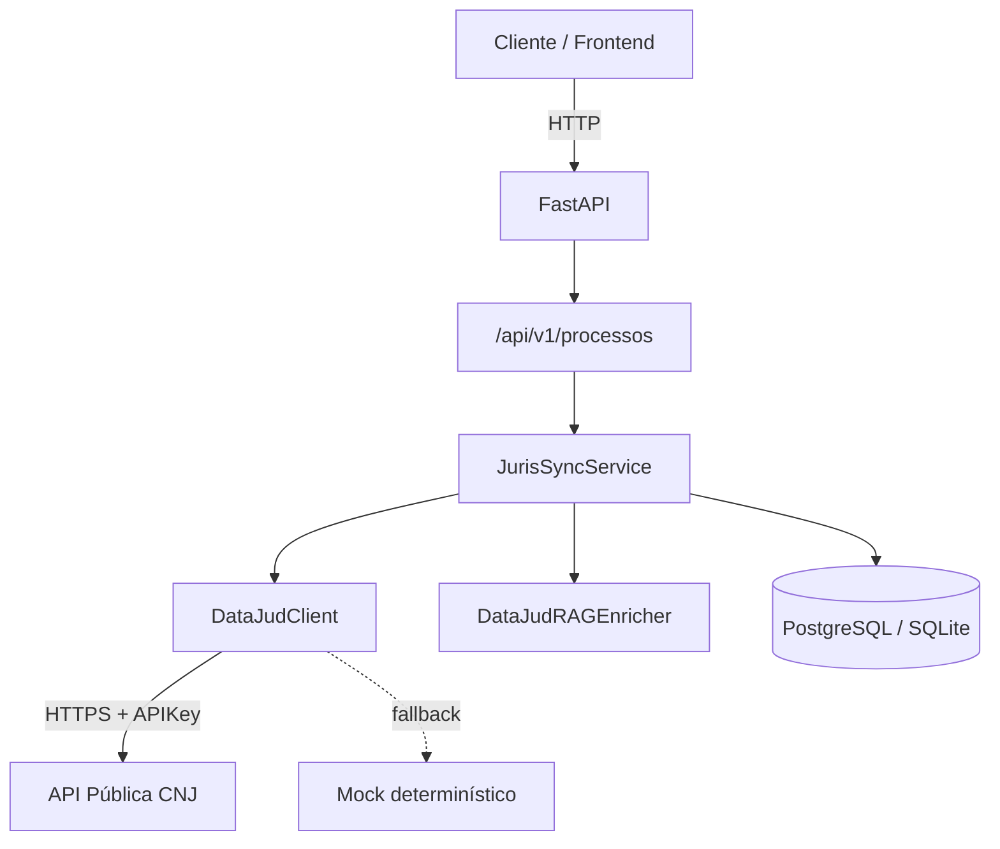

# JurisSync API

[](https://github.com/MariaHilmar/juris-sync/actions/workflows/ci.yml)


API REST assíncrona para **monitoramento, ingestão e jurimetria** de processos judiciais, integrada à [API Pública do DataJud (CNJ)](https://datajud-wiki.cnj.jus.br/api-publica/).

Projeto de portfólio que vai além de mostrar *como* integrar uma API: a intenção é demonstrar **como documentar e testar durante o desenvolvimento**, não só o resultado final.

- **Implementação** - camadas bem definidas, persistência idempotente, integração com o DataJud, logs estruturados, migrações versionadas e pipeline de CI.
- **Vibe docs** - requisitos, regras de negócio, histórias de usuário, cenários BDD e rastreabilidade requisito → código → teste em [`docs/requisitos.md`](docs/requisitos.md), escritos em paralelo ao código (documentação viva, não pós-facto).
- **Testes no fluxo de desenvolvimento** - suíte em camadas (unitário, API, mock HTTP, reconciliação, integração e contrato) guiando refatorações e evolução do domínio, com cobertura mínima de 85% no CI.

📄 **Documentação de requisitos:** [`docs/requisitos.md`](docs/requisitos.md)

---

## Destaques técnicos

- **FastAPI + SQLAlchemy 2.0 async** - I/O não bloqueante com `asyncpg` / `aiosqlite`
- **Motor DataJud** - integração real com API do CNJ + mock determinístico para desenvolvimento sem credenciais
- **Sincronização idempotente** - evita duplicar processos e movimentações
- **RAG em memória** - normalização de classe, assunto e tribunal antes da validação Pydantic
- **Alembic** - versionamento de schema (`processos`, `movimentacoes`)
- **Structlog** - logs legíveis em dev, JSON em produção
- **43 testes em 5 camadas** - unitário, API (ASGI), mock HTTP (`respx`), reconciliação de sync, integração (Testcontainers) e contrato OpenAPI (Schemathesis) - cobertura ≥ 85%
- **Documentação de requisitos** - regras de negócio, histórias de usuário, cenários BDD e rastreabilidade requisito → código → teste em [`docs/requisitos.md`](docs/requisitos.md)
- **GitHub Actions** - lint (Ruff, Black, Mypy) + testes (unitário + integração + contrato) em cada push/PR

---

## Arquitetura



### Fluxo de sincronização

1. **Extração** - `DataJudClient` consulta o tribunal correto (`api_publica_{alias}/_search`) ou gera mock a partir do CNJ
2. **Enriquecimento** - RAG recupera contexto jurídico e normaliza campos
3. **Validação** - Pydantic v2 valida formato CNJ e tipos
4. **Persistência** - upsert do processo + inserção apenas de movimentações novas

---

## Stack

| Camada | Tecnologia |
|--------|------------|
| API | FastAPI, Uvicorn |
| ORM | SQLAlchemy 2.0 (async) |
| Migrações | Alembic |
| Validação | Pydantic v2, pydantic-settings |
| HTTP externo | httpx |
| Logs | structlog |
| Testes | pytest, pytest-asyncio, pytest-cov |
| Qualidade | Ruff, Black, Mypy |
| Container | Docker, Docker Compose |

---

## Modelo de dados

| Tabela | Campos principais |
|--------|-------------------|
| `processos` | `numero_cnj` (único), `tribunal`, `classe`, `assunto`, `grau` |
| `movimentacoes` | `processo_id` (FK), `data_hora`, `descricao`, `codigo_movimento` |

---

## Endpoints

| Método | Rota | Descrição |
|--------|------|-----------|
| `GET` | `/health` | Status da API, banco e modo DataJud |
| `POST` | `/api/v1/processos/sync` | Sincroniza processo pelo número CNJ |
| `GET` | `/api/v1/processos/` | Lista processos paginados (`items`, `total`, `limit`, `offset`) |
| `GET` | `/api/v1/processos/{id}` | Detalhe com movimentações |
| `GET` | `/api/v1/processos/stats/por-tribunal` | Jurimetria por tribunal |
| `GET` | `/api/v1/processos/stats/por-assunto` | Jurimetria por assunto |

Documentação interativa: `GET /docs` (Swagger UI) ou `GET /redoc` (ReDoc).

### Exemplo

```bash
curl -X POST http://localhost:8000/api/v1/processos/sync \
  -H "Content-Type: application/json" \
  -d '{"numero_cnj": "0001234-56.2023.8.15.0001", "grau": 1}'
```

---

## Coleção Postman (uso manual/demo)

A pasta [`postman/`](postman/) contém uma coleção para **exploração manual e demonstração** da API - não faz parte da suíte automatizada de testes (essa fica em [`tests/`](tests/), veja a seção [Testes](#testes)).

| Arquivo | Conteúdo |
|---|---|
| `JurisSync.postman_collection.json` | Requisições para todos os endpoints, com casos positivos e negativos (422, 404) e testes JS embutidos |
| `JurisSync-Local.postman_environment.json` | Variáveis para apontar para `http://localhost:8000` |

Como usar:

1. Importe os dois arquivos no Postman (`File > Import`)
2. Selecione o environment **JurisSync - Local**
3. Rode **Sincronizar Processo com o DataJud** primeiro - o `processo_id` retornado é salvo automaticamente na variável de coleção e reutilizado por **Obter Detalhes do Processo**

Uso pretendido: onboarding, debug manual e smoke test pontual - não substitui pytest/Schemathesis/Testcontainers, que são a base de qualidade automatizada do projeto.

---

## Pré-requisitos

- Python **3.12+**
- (Opcional) Docker e Docker Compose
- (Opcional) Chave da API Pública DataJud - [solicitar no CNJ](https://datajud-wiki.cnj.jus.br/api-publica/acesso/)

---

## Execução local

```powershell
git clone https://github.com/MariaHilmar/juris-sync.git
cd juris-sync

python -m venv .venv
.venv\Scripts\Activate.ps1        # Windows
# source .venv/bin/activate       # Linux/macOS

pip install -r requirements-dev.txt
copy .env.example .env              # ou: cp .env.example .env
alembic upgrade head
python app/main.py
```

API disponível em http://localhost:8000

### Variáveis de ambiente

| Variável | Descrição | Padrão |
|----------|-----------|--------|
| `DATABASE_URL` | Conexão async (SQLite ou PostgreSQL) | `sqlite+aiosqlite:///./juris_sync.db` |
| `DATAJUD_API_KEY` | Chave API CNJ (vazio = mock) | - |
| `DATAJUD_API_URL` | Base da API pública | `https://api-publica.datajud.cnj.jus.br` |
| `ENV` | `development` / `production` | `development` |

---

## Docker

```bash
docker compose up --build
```

Em outro terminal, com `DATABASE_URL` apontando para o Postgres do compose:

```bash
alembic upgrade head
```

---

## 🧪 Testes Automatizados


O projeto conta com **43 testes automatizados** organizados em 5 camadas, cobrindo desde regras de negócio isoladas até fuzzing de contrato OpenAPI e integração com PostgreSQL real.

- **Testes unitários** - validam o comportamento isolado de `sync_service`, `datajud_client`, RAG e schemas Pydantic.
- **Testes de API** - disparam requisições HTTP reais (via `httpx.AsyncClient` + `ASGITransport`) contra os endpoints FastAPI, com banco SQLite em memória isolado por teste.
- **Mock de API externa** - intercepta a camada HTTP real com `respx`, validando o contrato exato da chamada ao DataJud (headers, payload) e os cenários de fallback (404, 500, timeout).
- **Reconciliação de sincronização** - garante fidelidade dos dados persistidos vs. fonte externa, atomicidade em falhas parciais e ausência de movimentações órfãs.
- **Integração e contrato** - PostgreSQL real via Testcontainers (com migrations reais do Alembic) e fuzzing do schema OpenAPI via Schemathesis/Hypothesis.

### Ferramentas utilizadas

| Categoria | Ferramenta |
|---|---|
| Framework de testes | **pytest** + **pytest-asyncio** |
| Cobertura | **pytest-cov** |
| Modo watch | **pytest-watch** |
| Cliente HTTP para testes de API | **httpx** (`AsyncClient` + `ASGITransport`) |
| Mocks/dados de teste | **factory-boy**, **respx** (mock de HTTP) |
| Banco real para integração | **Testcontainers** (PostgreSQL) |
| Contract testing / fuzzing | **Schemathesis** (Hypothesis) |
| Type checking | **Mypy** (Pydantic plugin) |

### Como executar os testes

Na raiz do projeto, com o ambiente virtual ativado:

```bash
# Rodar toda a suíte padrão (unitário + API + mock + reconciliação)
python -m pytest

# Rodar em modo watch (reexecuta automaticamente a cada alteração de arquivo)
ptw

# Gerar relatório de cobertura no terminal
python -m pytest --cov=app --cov-report=term-missing

# Gerar relatório de cobertura em HTML (abre htmlcov/index.html no navegador)
python -m pytest --cov=app --cov-report=html
```

A suíte padrão usa SQLite em memória com savepoints para isolar testes que fazem `commit`, e falha automaticamente se a cobertura ficar abaixo de **85%** (configurado em `pyproject.toml`).

Testes de integração (PostgreSQL real) e de contrato (OpenAPI) exigem Docker e são pulados por padrão. Para executá-los:

```bash
python -m pytest -m integration --no-cov   # exige Docker rodando localmente
python -m pytest -m contract --no-cov
```

### Saída real do terminal

```text
tests/test_api.py::test_api_health_endpoint PASSED                       [  3%]
tests/test_api.py::test_api_sync_process_endpoint PASSED                 [  6%]
tests/test_api.py::test_api_sync_invalid_cnj_returns_422 PASSED          [  9%]
tests/test_api.py::test_api_list_and_detail_processes PASSED             [ 12%]
tests/test_api.py::test_api_detail_returns_404_for_not_found PASSED      [ 15%]
tests/test_api.py::test_api_jurimetria_stats_endpoints PASSED            [ 18%]
tests/test_datajud_client.py::test_mock_client_generates_consistent_data PASSED [ 21%]
tests/test_datajud_client_contract.py::test_fetch_from_api_sends_expected_request_contract PASSED [ 46%]
tests/test_rag_enricher.py::test_rag_enricher_retrieves_context_and_normalizes_fields PASSED [ 59%]
tests/test_sync_reconciliation.py::test_reconciliation_rolls_back_completely_on_partial_failure PASSED [ 84%]
tests/test_sync_service.py::test_sync_new_movement_adds_only_the_new_one PASSED [100%]

---------------------------- tests coverage -----------------------------
Name                                 Stmts   Miss  Cover
------------------------------------------------------------------
app\services\sync_service.py            60      0   100%
app\services\datajud_client.py         104      3    97%
app\schemas\process.py                  61      3    95%
app\models\process.py                   34      2    94%
------------------------------------------------------------------
TOTAL                                  574     58    90%
Required test coverage of 85% reached. Total coverage: 89.90%
====================== 32 passed, 11 deselected in 1.73s ======================
```

> 💡 **Nota de cobertura:** o projeto mantém **89,9% de cobertura** na suíte padrão, com portão de qualidade (`--cov-fail-under=85`) que **falha o CI** automaticamente se a cobertura cair abaixo de 85%.

### Camadas de teste (referência completa)

| Camada | O que valida | Marcador |
|---|---|---|
| Unitário/API | Regras de negócio, schemas, endpoints (SQLite in-memory) | padrão |
| Mock de API externa | Contrato HTTP (headers, payload) e fallback do cliente DataJud, via `respx` | padrão |
| Reconciliação de sync | Fidelidade dos dados persistidos vs. fonte externa, atomicidade e ausência de órfãos | padrão |
| Integração | PostgreSQL real via **Testcontainers**, incluindo migrations reais do Alembic | `integration` |
| Contrato OpenAPI | Fuzzing do schema OpenAPI com **Schemathesis** (Hypothesis) | `contract` |

Regras de negócio e critérios de aceite testados por cada camada estão documentados em [`docs/requisitos.md`](docs/requisitos.md#9-rastreabilidade-requisito---código---teste).

---

## CI/CD (GitHub Actions)

O workflow [`.github/workflows/ci.yml`](.github/workflows/ci.yml) executa em push/PR para `main`:

| Job | Etapas |
|-----|--------|
| **Lint** | `ruff check` + `black --check` |
| **Test** | `pytest` com cobertura (suíte unitária/API) |
| **Integration** | Testes com PostgreSQL real (Testcontainers) + contract testing (Schemathesis) |

---

## Estrutura do projeto

```
juris-sync/
├── app/
│   ├── api/           # Rotas FastAPI
│   ├── core/          # Config, database, logging
│   ├── models/        # ORM SQLAlchemy
│   ├── schemas/       # Pydantic
│   ├── services/      # DataJud, sync, RAG
│   └── main.py
├── alembic/           # Migrações
├── tests/             # Pytest (unitário, mock, reconciliação, integração, contrato)
├── postman/           # Coleção Postman - uso manual/demo, não faz parte do CI
├── docs/              # Requisitos, regras de negócio, histórias de usuário, BDD
├── .github/workflows/ # CI
├── docker-compose.yml
├── Dockerfile
└── pyproject.toml     # Black, Ruff, Pytest
```

---

## Roadmap (sprints)

| Sprint | Entrega | Status |
|--------|---------|--------|
| 1 | Setup e boilerplate | ✅ |
| 2 | Banco + Alembic | ✅ |
| 3 | Motor DataJud | ✅ |
| 4 | Testes Pytest | ✅ |
| 5 | README + CI/CD | ✅ |

---

## Licença

Este projeto está licenciado sob a Licença MIT - veja o arquivo [LICENSE](LICENSE) para detalhes.
