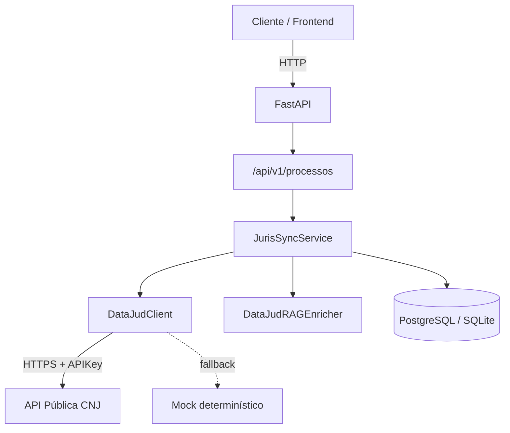

# JurisSync API

[](https://github.com/MariaHilmar/juris-sync/actions/workflows/ci.yml)


API REST assíncrona para **monitoramento, ingestão e jurimetria** de processos judiciais, integrada à [API Pública do DataJud (CNJ)](https://datajud-wiki.cnj.jus.br/api-publica/).

Projeto de portfólio com foco em boas práticas de engenharia: camadas bem definidas, persistência idempotente, logs estruturados, migrações versionadas e pipeline de CI.

---

## Destaques técnicos

- **FastAPI + SQLAlchemy 2.0 async** — I/O não bloqueante com `asyncpg` / `aiosqlite`
- **Motor DataJud** — integração real com API do CNJ + mock determinístico para desenvolvimento sem credenciais
- **Sincronização idempotente** — evita duplicar processos e movimentações
- **RAG em memória** — normalização de classe, assunto e tribunal antes da validação Pydantic
- **Alembic** — versionamento de schema (`processos`, `movimentacoes`)
- **Structlog** — logs legíveis em dev, JSON em produção
- **Pytest** — 23 testes, cobertura ≥ 85%
- **GitHub Actions** — lint (Ruff, Black) + testes em cada push/PR

---

## Arquitetura



### Fluxo de sincronização

1. **Extração** — `DataJudClient` consulta o tribunal correto (`api_publica_{alias}/_search`) ou gera mock a partir do CNJ
2. **Enriquecimento** — RAG recupera contexto jurídico e normaliza campos
3. **Validação** — Pydantic v2 valida formato CNJ e tipos
4. **Persistência** — upsert do processo + inserção apenas de movimentações novas

---

## Stack

| Camada | Tecnologia |
|--------|------------|
| API | FastAPI, Uvicorn |
| ORM | SQLAlchemy 2.0 (async) |
| Migrações | Alembic |
| Validação | Pydantic v2, pydantic-settings |
| HTTP externo | httpx |
| Logs | structlog |
| Testes | pytest, pytest-asyncio, pytest-cov |
| Qualidade | Ruff, Black |
| Container | Docker, Docker Compose |

---

## Modelo de dados

| Tabela | Campos principais |
|--------|-------------------|
| `processos` | `numero_cnj` (único), `tribunal`, `classe`, `assunto`, `grau` |
| `movimentacoes` | `processo_id` (FK), `data_hora`, `descricao`, `codigo_movimento` |

---

## Endpoints

| Método | Rota | Descrição |
|--------|------|-----------|
| `GET` | `/health` | Status da API, banco e modo DataJud |
| `POST` | `/api/v1/processos/sync` | Sincroniza processo pelo número CNJ |
| `GET` | `/api/v1/processos/` | Lista processos (filtros + paginação) |
| `GET` | `/api/v1/processos/{id}` | Detalhe com movimentações |
| `GET` | `/api/v1/processos/stats/por-tribunal` | Jurimetria por tribunal |
| `GET` | `/api/v1/processos/stats/por-assunto` | Jurimetria por assunto |

Documentação interativa: `GET /docs` (Swagger UI).

### Exemplo

```bash
curl -X POST http://localhost:8000/api/v1/processos/sync \
  -H "Content-Type: application/json" \
  -d '{"numero_cnj": "0001234-56.2023.8.15.0001", "grau": 1}'
```

---

## Pré-requisitos

- Python **3.12+**
- (Opcional) Docker e Docker Compose
- (Opcional) Chave da API Pública DataJud — [solicitar no CNJ](https://datajud-wiki.cnj.jus.br/api-publica/acesso/)

---

## Execução local

```powershell
git clone https://github.com/MariaHilmar/juris-sync.git
cd juris-sync

python -m venv .venv
.venv\Scripts\Activate.ps1        # Windows
# source .venv/bin/activate       # Linux/macOS

pip install -r requirements-dev.txt
copy .env.example .env              # ou: cp .env.example .env
alembic upgrade head
python app/main.py
```

API disponível em http://localhost:8000

### Variáveis de ambiente

| Variável | Descrição | Padrão |
|----------|-----------|--------|
| `DATABASE_URL` | Conexão async (SQLite ou PostgreSQL) | `sqlite+aiosqlite:///./juris_sync.db` |
| `DATAJUD_API_KEY` | Chave API CNJ (vazio = mock) | — |
| `DATAJUD_API_URL` | Base da API pública | `https://api-publica.datajud.cnj.jus.br` |
| `ENV` | `development` / `production` | `development` |

---

## Docker

```bash
docker compose up --build
```

Em outro terminal, com `DATABASE_URL` apontando para o Postgres do compose:

```bash
alembic upgrade head
```

---

## Testes

```bash
python -m pytest
```

A suíte usa SQLite em memória com savepoints para isolar testes que fazem `commit`. Cobertura mínima configurada: **85%**.

```bash
python -m pytest --cov=app --cov-report=term-missing
```

---

## CI/CD (GitHub Actions)

O workflow [`.github/workflows/ci.yml`](.github/workflows/ci.yml) executa em push/PR para `main`:

| Job | Etapas |
|-----|--------|
| **Lint** | `ruff check` + `black --check` |
| **Test** | `pytest` com cobertura |

---

## Estrutura do projeto

```
juris-sync/
├── app/
│   ├── api/           # Rotas FastAPI
│   ├── core/          # Config, database, logging
│   ├── models/        # ORM SQLAlchemy
│   ├── schemas/       # Pydantic
│   ├── services/      # DataJud, sync, RAG
│   └── main.py
├── alembic/           # Migrações
├── tests/             # Pytest
├── .github/workflows/ # CI
├── docker-compose.yml
├── Dockerfile
└── pyproject.toml     # Black, Ruff, Pytest
```

---

## Roadmap (sprints)

| Sprint | Entrega | Status |
|--------|---------|--------|
| 1 | Setup e boilerplate | ✅ |
| 2 | Banco + Alembic | ✅ |
| 3 | Motor DataJud | ✅ |
| 4 | Testes Pytest | ✅ |
| 5 | README + CI/CD | ✅ |

---

## Licença

Este projeto está licenciado sob a Licença MIT — veja o arquivo [LICENSE](LICENSE) para detalhes.
